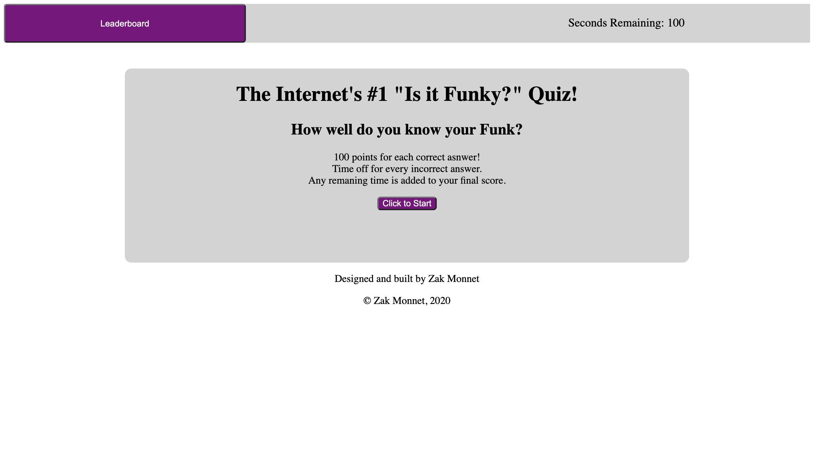

# 04-Code-Quiz
Homework #4

A 10 question "Is it Funky?" quiz

Preview:

Every correct question get you 100 points and every incorrect answer takes 10 seconds off your allowed time

Any remaining time is added to your final score

When the game is over you can enter your initials and they will be saved in the locally stored leaderboard

Runs on one HTML file, elements are hidden and made visible as needed

https://outoftune266.github.io/04-Code-Quiz/